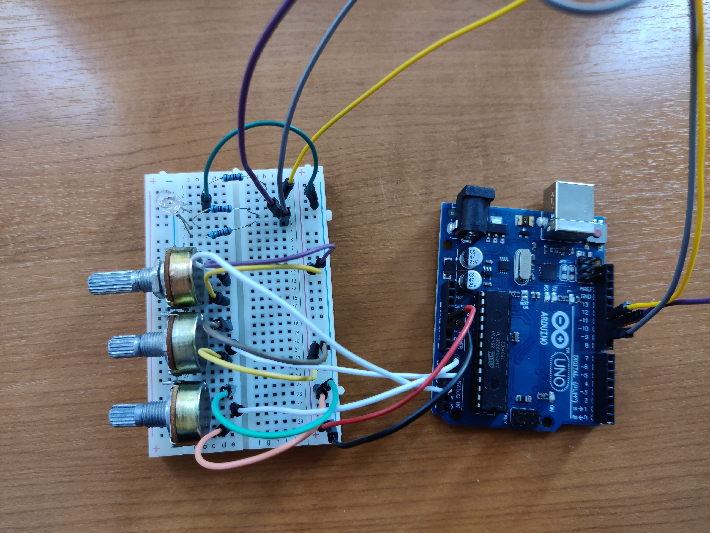
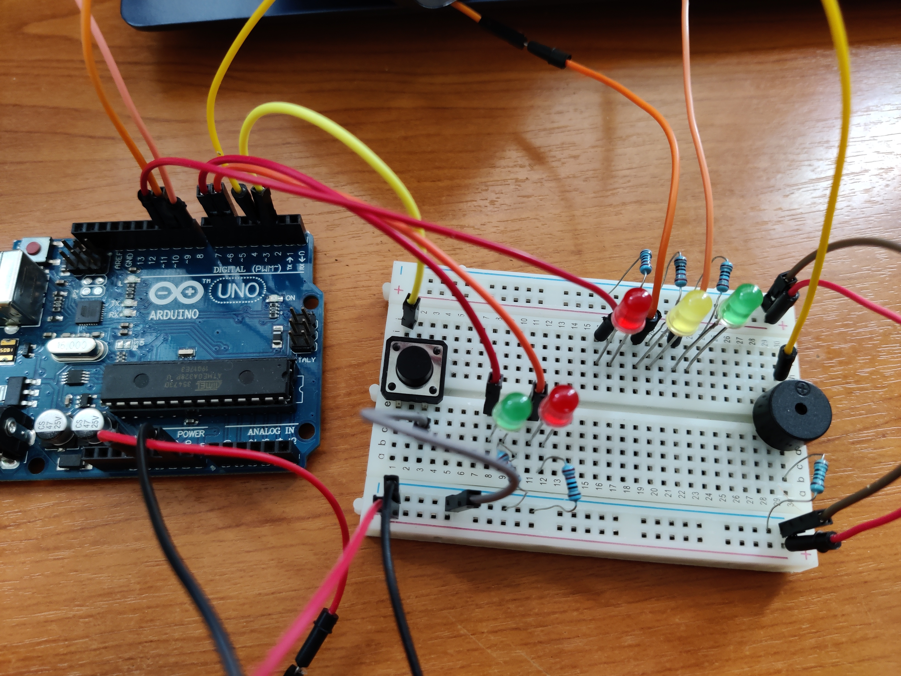
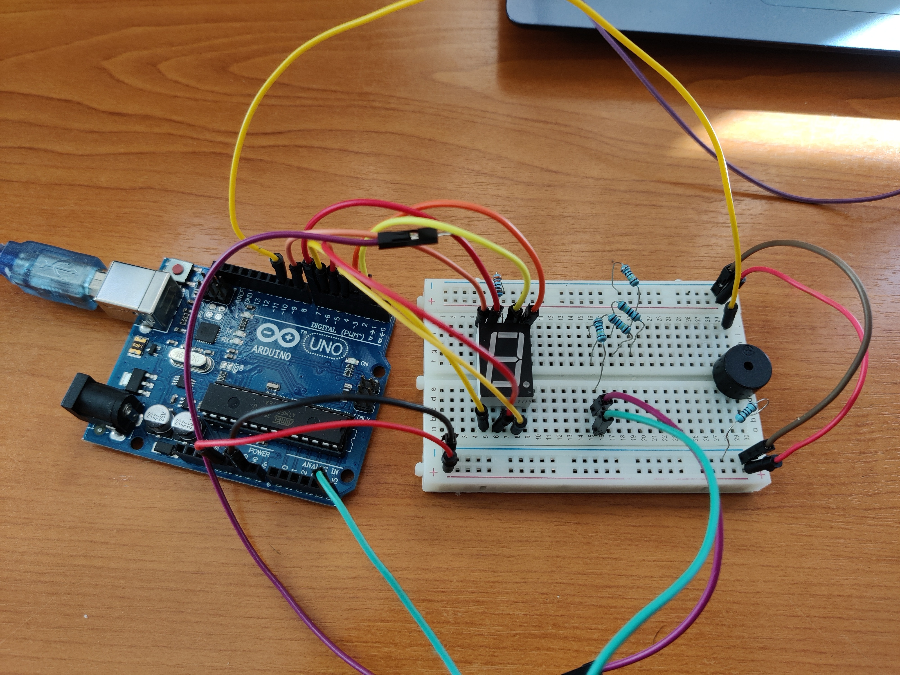

# Introduction to Robotics (2021-2022)

Introduction to Robotics laboratory homeworks, taken in the 3rd year at the Faculty of Mathematics and Computer Science, University of Bucharest. Each homework includes requirements, implementation details, code and image files.

## Homework 1 - RGB led controlled by potentiometers

#### Requirements
  - Components: RBG led (1 minimum), potentiometers (3 minimum), resistors and wires (per logic)
  - Technical Task: Use a separate potentiometer in controlling each of the color of the RGB led (Red, Green and Blue). The control must be done with digital electronics(aka you must read the value of the potentiometer with Arduino, and write a mapped value to each of the pins connected to the led.
#### Setup

#### Showcase video
https://youtu.be/jZD91t3Tabo

## Homework 2 - Traffic lights

#### Requirements
  - Components: 5 LEDs, 1 button, 1 buzzer, resistors and wires (per logic)
  - General description: Building the traffic lights for a crosswalk. You will use 2 LEDs to represent the traffic lights for people (red and green) and 3 LEDs to represent the traffic lights for cars (red, yellow and green). See the states it needs to go through.
  - The system has the following states:
    - 1. State 1(default, reinstated after state 4 ends): green light for cars, red light for people, no sounds. Duration: indefinite, changed bypressing the button.
    - 2. State 2(initiated by counting down 10 seconds after a button press): the light should be yellow for cars, red for people and no sounds. Duration: 3 seconds.
    - 3. State 3(iniated after state 2 ends): red for cars, green for people and a beeping sound from the buzzer at a constant interval. Duration: 10 seconds.
    - 4. State 4(initiated after state 3 ends): red for cars, blinking green for people and a beeping sound from the buzzer, at a constant interval, faster than the beeping in state 3.
#### Setup

#### Showcase video
https://youtu.be/HnS-Day5f88

## Homework 3 - EMF detector

#### Requirements
  - Components: a buzzer and a 7-segment display 
  - Task: should detect EMF. It should print the value on the 7-segment display and should make a sound based on the intensity.
#### Setup

#### Showcase video
https://youtu.be/r4UEuIfKNG0

